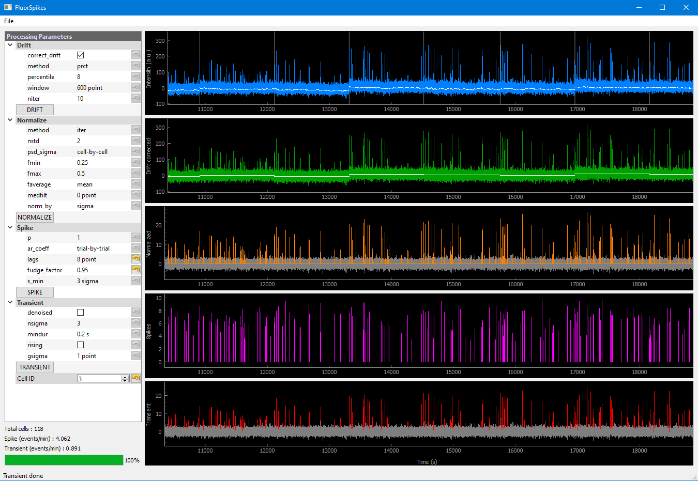

# FluorSpikes
This package implements GUIs in Python 3 for post-treatment of temporal sequences from calcium imaging data. Neuroscientists often use softwares such as [Suite2p](https://github.com/MouseLand/suite2p), [CaImAn](https://github.com/flatironinstitute/CaImAn) to extract calcium activity sequences. However, these temporal sequences are prone to baseline fluctuation or in- and out-of-focus motion during recording, which may hinder the correct identification of calcium transients and inferred spikes. FluorSpikes provides the following treatments in a user-freindly graphical interface:
* Background correction (require recording of a second non-functional channel)
* Drift correction (deal with baseline fluctuation)
* Normalization
* Spike deconvolution (with CaImAn's algorithm)
* Transient detection

## Installation
FluorSpikes uses CaImAn's algorithm to perform spike deconvolution, so you need to first install CaImAn following the instructions [here](https://github.com/flatironinstitute/CaImAn/blob/main/docs/source/Installation.rst).

Then, you can download the FluorSpikes source codes or
```
git clone https://github.com/chenhungling/FluorSpikes
cd FluorSpikes/fluorspikes
```

FluorSpikes uses standard Python packages such as [PyQt5](https://doc.bccnsoft.com/docs/PyQt5/), [pyqtgraph](https://pyqtgraph.readthedocs.io/en/latest/) and [h5py](https://www.h5py.org/) that come with CaImAn's installation. Thus, you can then run FluorSpikes in `caiman` environment (assume you call `caiman` for your CaImAn installation):
```
conda activate caiman
python fluorspikes_caiman.py
```

We also support reading Suite2p's output data, simply evoke the corresponding script (always in `caiman` environment):
```
python fluorspikes_suite2p.py
```

You can also run `fluorspikes_caiman.py` and `fluorspikes_suite2p.py` in [Spyder](https://www.spyder-ide.org/). However, you will need to set: Run / Configuration per file / Execute in an external system termal, to avoid conflict between Spyder's interactive console and PyQt5's event loop.

## Getting started

### Using the GUI
<center></center>

### Outputs